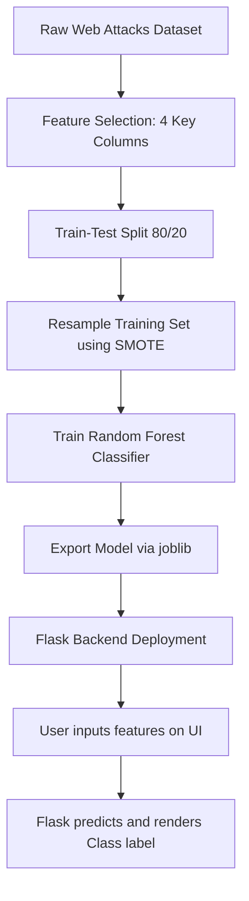

# 🔐 AI-Enhanced Intrusion Detection System (IDS)

[](https://www.python.org/)
[](https://flask.palletsprojects.com/)
[](https://scikit-learn.org/)
[](https://pandas.pydata.org/)
[](https://opensource.org/licenses/MIT)

An intelligent, machine-learning-powered cybersecurity solution designed to detect and classify network-based intrusions in real-time. By leveraging a high-performance **Random Forest Classifier** trained on resampled network flow metrics, this system protects critical digital assets from malicious traffic and web-based exploits.

---

## 🚀 Key Features

- **Real-Time Analysis**: Quickly evaluates network connection details and returns prediction labels.
- **Glassmorphic Web Interface**: A premium, responsive web dashboard built with a modern, glassmorphic layout and interactive visual states.
- **Data Balancing (SMOTE)**: Leverages Synthetic Minority Over-sampling Technique (SMOTE) to mitigate data imbalance across minority attack classes.
- **Optimized Feature Set**: Specifically targets **4 key network metrics** to maximize accuracy while minimizing inference latency.
- **Comprehensive Lifecycle Coverage**: Documented phases spanning ideation, scheduling, system architecture, performance testing, and final reporting.

---

## 🧠 Machine Learning Architecture



### 📊 Dataset Analysis
The underlying classifier is trained on the `web_attacks_balanced.csv` dataset, which contains both benign network activities and various categories of web-based attacks:

| Class Label | Description | Sample Count (Raw) | Status / Handling |
| :--- | :--- | :---: | :--- |
| **`BENIGN`** | Normal, safe network traffic | 5,087 | Majority class |
| **`Web Attack - Brute Force`** | Password cracking and dictionary attacks | 1,507 | Resampled |
| **`Web Attack - XSS`** | Cross-Site Scripting injections | 652 | Resampled |
| **`Web Attack - Sql Injection`**| Malicious SQL command injections | 21 | Resampled via SMOTE |

### 🛠 Selected Features (4 Key Inputs)
To ensure rapid inference speeds suitable for live intrusion detection, the model uses a highly optimized subset of four network parameters:
1. **Flow Duration**: Duration of the network flow in microseconds.
2. **Total Fwd Packets**: Total packets sent in the forward direction.
3. **Total Backward Packets**: Total packets sent in the backward direction.
4. **Total Length of Fwd Packets**: Total size of packets sent in the forward direction (in bytes).

---

## 📁 Repository Structure

The project follows a standard structured software engineering lifecycle, divided into development and planning documentation phases:

```
ai-enhanced-intrusion-detection-system/
├── CYBER_PROJECT/                       # Active Flask project and model files
│   ├── templates/
│   │   └── index.html                   # Glassmorphic prediction dashboard
│   ├── app.py                           # Flask server backend
│   ├── random_forest_model_4_features.joblib # Trained Random Forest Classifier
│   ├── Untitled.ipynb                   # Model exploration, SMOTE & RF training notebook
│   └── web_attacks_balanced.csv         # Network attack dataset
├── Ideation Phase/                      # Brainstorming and project selection notes
├── Performance & Final Submission/      # Final project reports and submission documentation
├── Project Design Phase/                # Solution architecture, DFDs, and user stories
├── Project Development Phase/           # Model testing logs and development milestones
├── Project Planning Phase/              # Project schedule, plans, and technology stack selection
└── README.md                            # Project overview and setup instructions
```

---

## ⚙️ Installation & Setup

Ensure you have Python 3.10+ and a package manager (such as `conda` or standard `pip`) installed.

### 1. Clone the Repository
```bash
git clone https://github.com/PurvaPatil-hub/ai-enhanced-intrusion-detection-system.git
cd ai-enhanced-intrusion-detection-system
```

### 2. Environment Configuration
Choose **one** of the methods below to configure your workspace environment.

#### Option A: Conda (Recommended)
```bash
# Create a new environment
conda create -n cyber_ids python=3.10 -y

# Activate the environment
conda activate cyber_ids
```

#### Option B: Python venv
```bash
# Create a virtual environment
python -m venv venv

# Activate on Windows (cmd/PowerShell)
.\venv\Scripts\activate
# Activate on Linux/macOS
source venv/bin/activate
```

### 3. Install Dependencies
Install the required packages:
```bash
pip install flask scikit-learn pandas numpy joblib imbalanced-learn
```

---

## 🏃 Running the Application

1. Navigate to the core project directory:
   ```bash
   cd CYBER_PROJECT
   ```

2. Launch the Flask web server:
   ```bash
   python app.py
   ```

3. Open your browser and navigate to:
   ```
   http://127.0.0.1:5000/
   ```

4. Enter network parameter values into the interface (e.g., `Flow Duration`, `Total Fwd Packets`) and click **Predict** to classify the network traffic.

---

## 🛡️ License

This project is licensed under the MIT License - see the [LICENSE](LICENSE) file for details.
